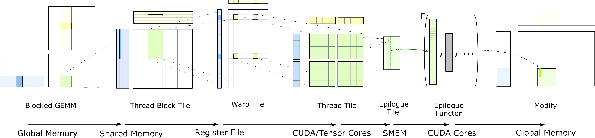
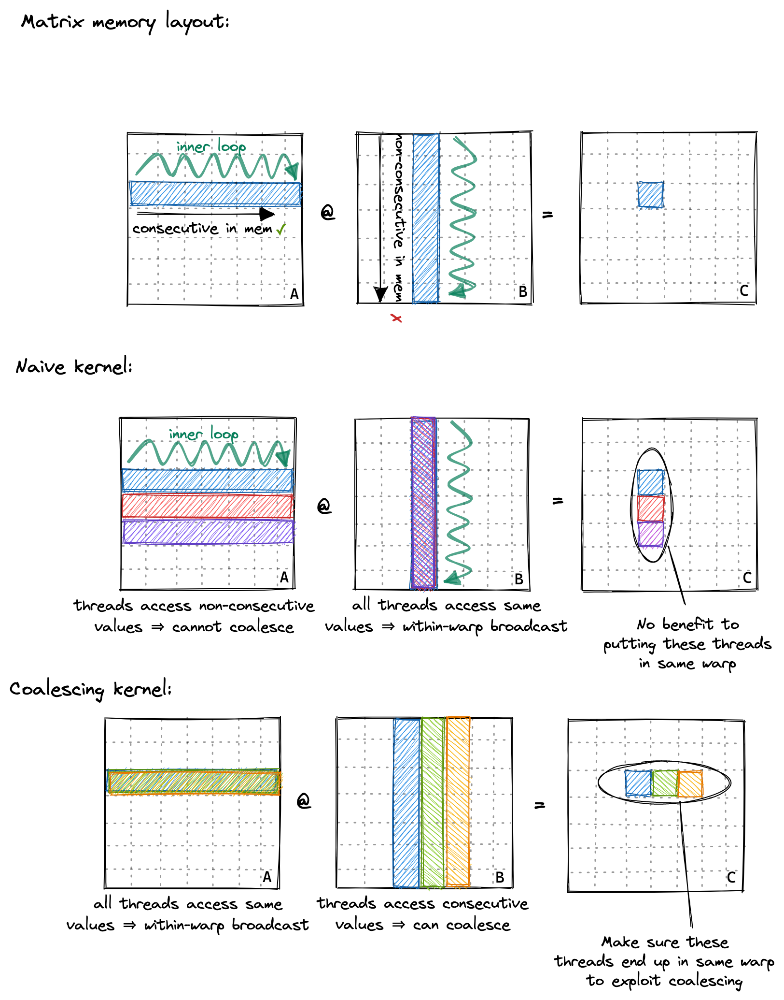
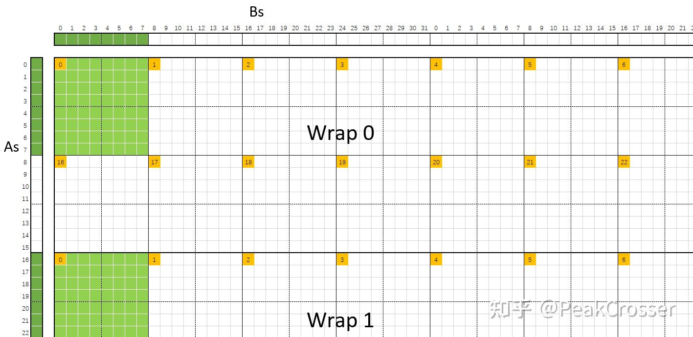
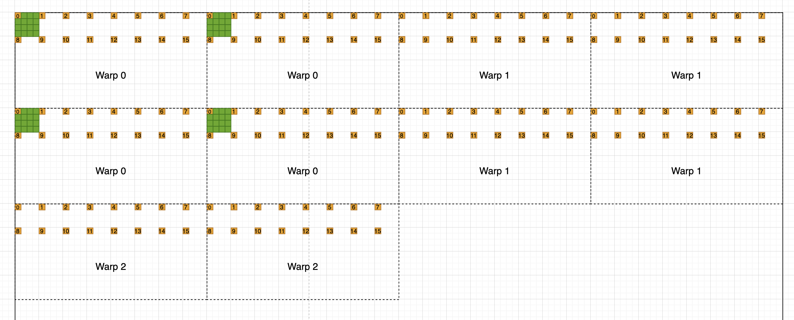
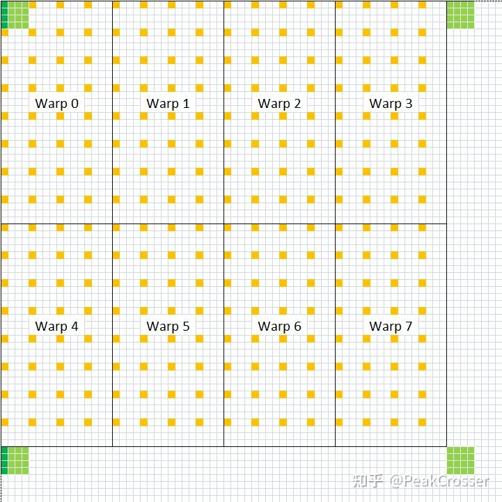

# GEMM
This repo shows how to optimize the GEMM and analysis the theoretical performance. Throughout the project, we assume the dimensions of the left and right matrices are `​​A: M × K, ​​B: K × N​`, and `​​C: M × N`​​ for the resulting matrix, respectively. What's more, we will also assume `M，K` and `N` is also the multiply of the tiling size. 

Throughout the implementation, we maintain strict coordinate mapping where:
- Row indices (row_id) align with the ​​y-dimension​​
- Column indices (column_id) align with the ​​x-dimension​

This memory mapping scheme delivers two key advantages:
- ​​Intuitive Alignment​​ - Matches developers' natural row/column mental model
​- ​Memory Access Performance Benefits​​ - Enables critical optimizations we'll analyze later



## Naive
The simplest matrix parallelization scheme is: ​​launch/spawn​​ `M × N` threads in a block, with each thread ​​assigned to compute a single element​​ (i.e., one row and one column combination) of the result matrix. However, this method can not be used in the real world, because GPU limits the maxmum number of threads(1024) in a thread block

## Thread block tiling
We leverage a grid of multiple thread blocks for computation, as GPUs typically support massive blocks in a grid (varying by compute capability limits). In this architecture:

- Each thread block computes a `(bm, bn)` submatrix of the result matrix
- Individual threads within a block each compute one element of this submatrix

### Analysis
Given that threads within a warp are consecutively numbered along the x-dimension, for a (32, 32) thread block configuration:

- ​​Matrix A Access Pattern​​: All threads in a warp access the same row of A results in perfect memory coalescing:
    - Single global memory read transaction and then broadcast across threads within warp
    - 32:1 bandwidth compression (ideal case)
- ​​Matrix B Access Pattern​​: Threads access consecutive columns of B achieves sequential memory coalescing:
    - Aligned 128-byte memory transactions (typical for modern GPUs)
    - 32 threads × 4-byte floats = 128-byte perfect utilization
    - Single transaction services entire warp

If we do not consider L1 Cache, this approach still need to read the A matrix `n` times and B matrix `m` times from the global memory. A simple and effective improvement is using the faster shared memory on chip to reduce the number of bytes fetched from global memory

If we transpose the coordinate mapping, we will get bad performance. Let's analysis the memory access pattern to figure it out. From now on, consecutive threads in the warp will access consecutive rows in the A matrix. Because the consecutive rows memory is not continuous, warp can not coalesce the memory access into single transcations, we need `bm` transcations in a warp to load the data. It heavily increase the HBM read latency. 

The following figure visualize above two memory access patterns. Our original coordinate mapping is the coalescing kernel and the tranposed coordinate mapping is the naive kernel



## Thread block tiling with shared memory
Let's add shared memory to the above method becasue **shared memory is much faster than global memory and can be shared by the thread block**. Ideally, we want to use shared memory to cache the `bm * k` and `bn * k` submatrices of `A` and `B`. However the size of shared memory is limited, so we need a tiling strategy to divide the `bm * k` and `bn * k` submatrices into multiple `bm * bk` and `bk * bn` tiles. Shared memory only used to store the `bm * bk` submatrix of `A` and `bk * bn` submatrix of `B`. In this approach, each thread still compute one element in thre resulting matrix.

```python
__shared__ a_shared[bm][bk]
__shared__ b_shared[bk][bn]
# Outer loop over the k because we use k tiling to store submatrix in shared memory
for i in range(0, k, bk)
    fetch_a_sub_into_shared_memory(i)
    fetch_b_sub_into_shared_memory(i)
    # Confirm all of threads in the thread block has finished loading global memory
    # to shared memory, such that computation can use the shared memory
    __syncthreads()
    c = 0.0
    # Inner loop over the bk
    for j in range(0, bk)
        c += a_shared[ty][j] * b_shared[j][tx]
    # Confirm all of threads in the thread block has finished computation, such that
    # we can fetch the next submatrix
    __syncthreads()
```


**Question**: how to load the shared memory if `bn != bm != bk`. If they all have same value, we can let each thread in the thread block load a single element of the submatrix.

**Answer**: A simple solution is enfore `bm * bk` and `bk * bn` is multiply of the thread number, such that each thread only needs to load `bm * bk / NUM_THREADS_PER_THREAD_BLOCK` for A matrix and `bk * bn / NUM_THREADS_PER_THREAD_BLOCK` for B matrix.

### Analysis
In this approach, the A matrix is only read `n / bn` times from the global memory and the b matrix is only read `m / bm` times from the global memory. We have readuced lots of total bytes that need to be load from global memory. We will use `bm=32`, `bn=32` and `bk=8` to perform analysis on v100

#### Occupancy:
- **Shared Memory**: Each thread block will use `32 * 32 * 8 * 4B(size_of_float) = 32KB` shared memory. What's more, CUDA runtime will use extra `1KB` shared memory for each thread block. Therefore, each thread block will use `33KB` shared memory. Given that most GPU architectures enforce a ​​per-SM shared memory limit of `100KB​​`, our kernel design can only accommodate ​​3 thread blocks per SM
- **Threads**: max thread of per sm is 2048 means upper limit 2 blocks
- **Registers**: In our implementation, each thread will use 37 registers, the warp will use `37 * 32 = 1184` registers. Because register is allocated in the **allocation unit**(256) for each thread wap, hence each thread warp is rounding up to `ceil_div(1184, 256) * 256 = 1280` registers per warp. We have `1024 / 32 = 32` warps per thread block, hence `32 * 1280 = 40960` registers is required per thread block. So, our kernel design can only contain 1 thread block per SM

Above all, the kernel is limited by the number of registers per thread.

#### Memory access pattern
Within each warp, each thread also access the same memory address for the `a_shared` submatrix and consecutive threads access consecutive columns of `b_shared` submatrix. For `a_shared`, beucase of broadcast, no bank conflicts here. For `b_shared`, consecutive columns belongs to different banks, also no bank conflicts. If we transpose `a_shared` to `a_shared[bk][bm]`, single thread within a warp will access noncontinuous memory and decrase the performance. If we transpose the `b_shared`, single thread will access continuous memory however however how bank conflicts happens and decrase the performance a lot

In this approach, each **thread block** need to read from shared memory `2 * bm * bn * k` times to compute the `bm * bn` results. Which means that each result need `2k` shared memory acces. Following the caching idea, we can use registers, faster than shared memory, to cache the data in shared memory to reduce the read latency.


## Thread tiling
The fundamental shift occurs because **threads exclusively own their registers**, requiring a modified block tiling strategy. To maximize data reuse from shared memory, each thread must now compute multiple output elements through register caching. For each thread in the thread block, we require it to compute `tm * tn` submatrix of the blocked submatrix, using as much registers as possible to cache the shared data

From now on, the block shape has changed. In the above methods, each block has `(bm, bn)` threads. Now, each thread compute `tm * tn` submatrix of the `bm * bn` blocked submatrix, we need `bm * bn / (tm * tn)` threads in each block. Hence the block shape becomes `(bm / tm, bn / tm)`. As we can see, the `NUM_THREADS_PER_BLOCK` is not equal to the blocked submatrix now! Recall the Q&A in shared-block-tiling, each threads now need to load multiple elements from global memory to shared memory

To compute the thread tiling result, each thread should perform:
```python
c[tm][tn]

for iter in range(k /bk)
    # Native matrix multiply
    for i in range(tm):
        for j in range(tn):
            for p in range(bk):
                c[i][j] += a_shared[i][p] * b_shared[p][j]
```

In the native multiply form, we need to repeatedly load data from shared memory into register then perform computation. For example the `a_shared[0][0]` element, we need to load it `tn` times from shared memory for different columns. From the code perspective, reorder the for iteration order does not change the result. Therefore, we can move the `for p in range(bk)` iteration to the outer and then cache the `a_shared[:][p]` and `b_shared[p][j]` to avoid loading same data from shared memory repeatedly. Following code shows how it works:
```python
c[tm][tn]            

for iter in range(k /bk)
    for p in range(bk):
        a_thread_tiled[tm] = a_shared[:][p]
        b_thread_tiled[tn] = b_shared[p][:]
        for i in range(tm):
            for j in range(tn):
                c[i][j] += a_thread_tiled[i] * b_thread_tiled[j]
```

Let's look at the innermost two layers of for loops, it is the **outer product** form of two vectors! 


### Analysis
We will assume `bm = 128`, `bn = 128`, `bk = 8`, `tn = 8` and `tm = 8` in the following analysis

#### Number of memory access
Each thread will access the global memory `k / bk` times(outer loop) to load the blocked shared memory. Recall that there are `bm * bn / (tm * tn) = 256` threads in the thread block. Therfore, to fullfill the shared memory, each thread need to load `bm * bk / 256 = 4` elements for the `a_shared` and `bk * bn / 256 = 4` elements for the `b_shared`. Therefore, each thread will perform `k / bk * (4 + 4) = k` times loads from global memory

For shared memory, each thread will also access it `k / bk` times(outer loop). Each access time will load `bk * (tn + tm)` data into registers. Hence it will read from shared memory `k / bk * bk * (tn + tm) = 16k` times.

Above all, `k` times global memory access and `16k` times shared memory access could compute `tm * tn = 64` results. Each result need `k/64` global memory access and `k/4` shared memory access. This optimization reduces shared memory access frequency from `2k` reads per output element to just `k/4` reads - a `8×` improvement - through strategic register caching and computational reuse.

#### Memory Access pattern
For thread in the warp, it loads noncontinuous smemory address to `a_thread_tiling`. It is very inefficient. as described above In both case, we do not tranpose the `a_shared`, however the access pattern changed now. Therfore, in this case, a simple approach to accelerate shared memory load is transpose the `a_shared[bm][bk]` to `a_shared[bk][bm]`, such that single thread will load the continus memory. Will this operation increase or decrease bank conflicts?

Let's visualize whether bank conflicts occur when accessing the a_sharedand b_sharedmatrices. As shown in the diagram below:
- The ​​large square​​ represents a ​​128×128 result matrix​​.
- The ​​orange squares​​ highlight threads within a warp.
- The threads are arranged in a ​​2×16 pattern within each warp​​ due to our implementation:
    - Warps consists of 32 consecutive threads
    - Adjacent threads compute different bnsub-blocks (i.e., tn).
    - Each thread computes an ​​8×8 tile​​ of the result matrix.

To compute its ​​8×8 tile​​, each thread loads:
- ​​8 elements from a_shared​​ (left side of the diagram, showing ​​bank IDs​​ for each access).
​- ​8 elements from b_shared​​ (top side of the diagram, showing ​​bank IDs​​).

​​Highlighted Example (Warp Thread #0)​​:
- ​​Dark green​​ regions mark
    - The specific `a_shared` and `b_shared` elements loaded by ​​Thread 0​​ in the warp​​
- Light green​​ regions show:
    - The ​​8×8 result submatrix​​ computed via ​​outer-product operations​​ from these loaded values.



As we can see, **each warp** will access `16` elements from `a_shared` and `128` from `b_shared`. Hence bank conflicts does not happens when accessing the `a_shared` in the shared memory. Therefore, we can answer the above question now, tranpose `a_shared` does not cause bank conflicts and can increase the load locality

However, threads with an index difference of 4 within the same warp will access the same set of 8 banks for `b_shared`, resulting in ​​`8(32/4)-way bank conflicts​​`. For example, thread `0` will load `[0,7]` floats(`[0,31]` bytes belongs to bank 0) in `b_shared` and in the same time, because they are in the same warp, thread `4` will load `[32, 39]` floats(`[128, 159]` bytes belongs to bank 0).


## Warp tiling

> **Warp tiling** souds is somewhat confusing since unlike blocks and threads, warps don’t show up anywhere in the CUDA code explicitly. They are a hardware feature that has no direct analog in the scalar CUDA-software world. 

[How to Optimize a CUDA Matmul Kernel for cuBLAS-like Performance: a Worklog](https://siboehm.com/articles/22/CUDA-MMM) introduce the warp tiling directly and shows it can accelerate the computation. However, it does not explain why do we need it. [Prefetch 与 Bank Conflict解决](https://zhuanlan.zhihu.com/p/696844342) directly explains why the warp tiling can solve the bank coflicts, but does not clarify how to construct such a solution. Moreover, the rearrangement of ​​warps within a thread block​​ introduces additional complexity, making the design even more confusing to understand. How can we rearrangement the warps, it does not show up in the CUDA code!

To ​​avoid bank conflicts​​, a single warp should compute **​​at most** a `32×32` tile​​ of the result matrix at once. Exceeding this limit will inevitably cause bank conflicts. We refer to the tiled submatrix computed by a warp as the ​​warp_tile size​​, denoted by the dimensions `wm` and `wn`. Now, we can divide the result matrix into `bm * bn / (wm * wn)` wrap_tiled matrices. 

This problem can be reframed as: **Maximize warp count while optimizing register usage per warp to compute the result matrix efficiently​​**. If we use `i` warps to perform computation, each warp need to perform `iter = bm * bn / (wm * wn) / i` iterations. Each thread need `iter * wm * wn / 32 = bm * bn / 32i` registers to store the wrap_tiled result and `tn + tm` registers to store the data load from `a_shared` and `b_shared`. For warp tiling, there are two primary iteration approaches:
- Single-Warp Sequential Processing: One warp handles multiple consecutive warp tiles. This approach suffers from ​​non-contiguous memory access patterns​​ across warps and reduce the spatial locality. [How to Optimize a CUDA Matmul Kernel for cuBLAS-like Performance: a Worklog](https://siboehm.com/articles/22/CUDA-MMM) use this method in its kernel 10



- Multi-Warp Strided Processing: Multiple warps collaborate on consecutive tiles, with each warp processing tiles at a fixed stride (equal to the number of warps). [深入浅出GPU优化系列：GEMM性能优化 三](https://zhuanlan.zhihu.com/p/481600052) use this method to perform optimization



Assume `bm = 128`, `bn = 128`, `tn = 4`, `tm = 4` and `wn = 32`, we can derive that `wm = 32 / (wn / tn) * tm = 16`. Threfore, the result matrix can be tiled into `32` warp_tiled matrix. Assume we will use `8` warps with strided processing to perfrom computation, then we will derive the solution described in the [Prefetch 与 Bank Conflict解决](https://zhuanlan.zhihu.com/p/696844342). 

## Double Buffer

## Vector load with float4

## Metaphysical
- [ ] In L20, while loop is faster than for loop, wtf?

# Reference
- [CUDA GEMM理论性能分析与kernel优化](https://zhuanlan.zhihu.com/p/441146275)
- [深入浅出GPU优化系列：GEMM性能优化](https://zhuanlan.zhihu.com/p/435908830)
- [Prefetch 与 Bank Conflict解决](https://zhuanlan.zhihu.com/p/696844342): **warp tiling**
- [How to Optimize a CUDA Matmul Kernel for cuBLAS-like Performance: a Worklog](https://siboehm.com/articles/22/CUDA-MMM)
- [maxas-gemm](https://github.com/NervanaSystems/maxas/wiki/SGEMM)
- [Fast linear algebra in CUDA C++](https://developer.nvidia.com/blog/cutlass-linear-algebra-cuda/)