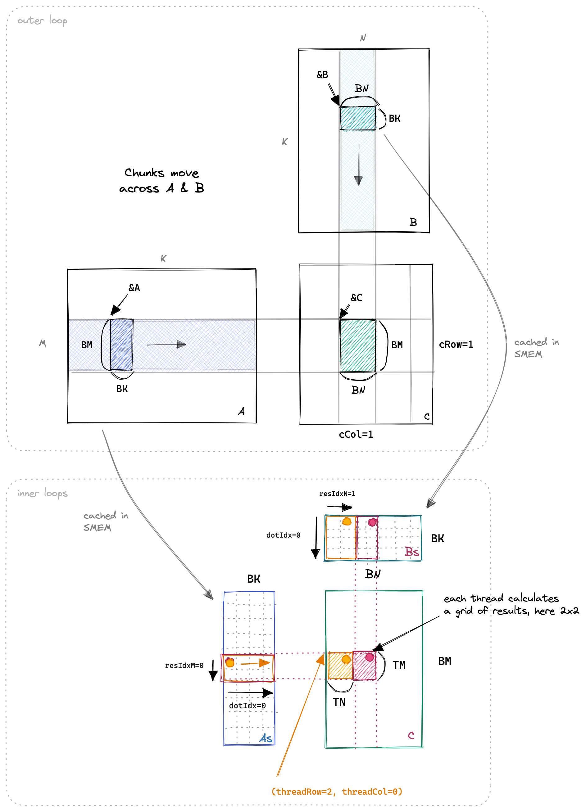

# GEMM

This project shows how to optimize the GEMM and analysis the theoretical performance. Throughout the project, we assume the dimensions of the left and right matrices are `​​A: M × K, ​​B: K × N​`, and `​​C: M × N`​​ for the resulting matrix, respectively. What's more, we will also assume `M，K` and `N` is also the multiply of the `bm, bk` and `bn`

## Naive
The simplest matrix parallelization scheme is: ​​launch/spawn​​ `M × N` threads in a block, with each thread ​​assigned to compute a single element​​ (i.e., one row and one column combination) of the result matrix. However, this method can not be used in the real world, because GPU limits the maxmum number of threads in a thread block

## Thread block tiling

TODO

## Thread block tiling with shared memory
Let's add shared memory to the above method becasue shared memory is much faster than global memory. Ideally, we want to use shared memory to cache the `bm * k` and `bn * k` submatrices of `A` and `B`. However the size of shared memory is limited, so we need a tiling strategy to divide the `bm * k` and `bn * k` submatrices into multiple `bm * bk` and `bk * bn` tiles. Shared memory only used to store the `bm * bk` submatrix of `A` and `bk * bn` submatrix of `B`.


Question: how to load the shared memory if `bn != bm != bk`. If they all have same value, we can let each thread in the thread block load a single element of the submatrix.
Answer: A simple solution is enfore `bm * bk` and `bk * bn` is multiply of the thread number, such that each thread only needs to load partial elements

## Thread tiling
In the above method, each **thread block** need to read from shared memory `2 * bm * bn * k` times. Following the tiling idea, we can use the registers to tile the blocked submatrices because register is faster than shared memory. For each thread in the thread block, we require it to compute `tm * tn` submatrix of the blocked submatrix, using as much registers as possible to cache the shared data. To compute the thread tiling result, each thread should perform:
```python

c[tm][tn]            

for iter in range(k /bk)
    for i in range(tm):
        for j in range(tn):
            for p in range(bk):
                c[i][j] += a_block_tiled[i][p] * b_block_tiled[p][j]
```

If we change the loop order, we can use registers to cache the reused data, this form is the **out product** of vectors!
```python

c[tm][tn]            

for iter in range(k /bk)
    for p in range(bk):
        a_thread_tiled[tm] = a_block_tield[:][p]
        b_thread_tiled[tn] = b_block_tield[p][:]
        for i in range(tm):
            for j in range(tn):
                c[i][j] += a_thread_tiled[i] * b_thread_tiled[j]
```




## Warp tiling
TODO: analysis, why warp size is (4, 8) or (8,4)

## Double buffer

# Theoretical analysis

# Reference
- [CUDA GEMM理论性能分析与kernel优化](https://zhuanlan.zhihu.com/p/441146275)
- [深入浅出GPU优化系列：GEMM性能优化](https://zhuanlan.zhihu.com/p/435908830)
- [Prefetch 与 Bank Conflict解决](https://zhuanlan.zhihu.com/p/696844342): **warp tiling**
- [How to Optimize a CUDA Matmul Kernel for cuBLAS-like Performance: a Worklog](https://siboehm.com/articles/22/CUDA-MMM)
- [maxas-gemm](https://github.com/NervanaSystems/maxas/wiki/SGEMM)